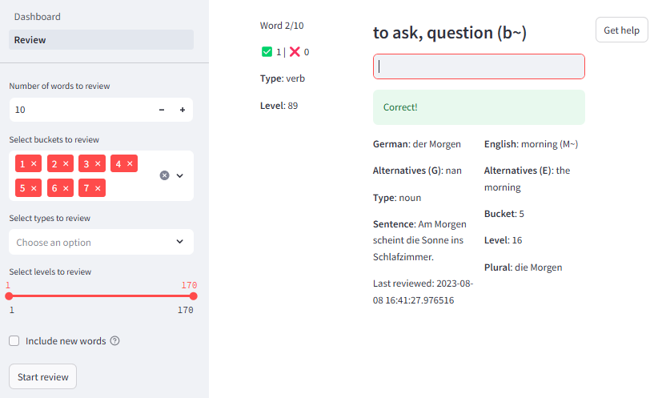

## Dummkopf

Memorize German vocabulary with card-based [spaced repetion](https://en.wikipedia.org/wiki/Spaced_repetition) techniques. A key concept is a **bucket**. Each word is assigned to a bucket and, by default it is assigned to bucket 0. When a word is reviewed, and the user correctly translates it, the word is moved to the next bucket. If the user fails to translate the word, the word is moved back one bucket. 

There are 7 buckets in total, and when a word would be moved from bucket 7, it is considered as learned. An important detail is that the time between reviews increases with the bucket number:

```python
MIN_DAYS_BETWEEN_REVIEWS = {1: 1, 2: 1, 3: 3, 4: 3, 5: 5, 6: 8, 7: 13}
```


The application is built with [Streamlit](https://www.streamlit.io/).
The vocabulary is based on the dataset from this [dataset](https://ankiweb.net/shared/info/994693053). 

---
### Set-up

1. Clone the repository
2. Create a virtual environment and install the requirements:
```bash
python3 -m venv venv
source venv/bin/activate
pip install -r requirements.txt
```
3. Run the application:
```bash
streamlit run Dashboard.py
```
---
### Tutorial

The main page of the application is the Dashboard page. This is a screenshot of what it looks like:


The Dashboard gives an overview of the learning progress:
- Total words to learn
- Words reviewed in the last 24 hours
- Words reviewed in the last 7 days
- Percentage of words reviewed at least once
- Average bucket of the words reviewed
- Distribution of the words reviewed into buckets
- Evolution of the number of words reviewed over the last week

After taking a look at the Dashboard, the user can start reviewing words by clicking on the "Review" button. This is a screenshot of what it looks like:



On the left panel, the user is asked to select the details of the review. The user can choose:
- Number of words to review (default: 10, it is expected to review in small batches, so that you can take a look at the incorrect answers)
- Buckets to review (default: all buckets)
- Types of word to review (allows to filter by word type, e.g. noun, verb, adjective, etc.)
- Select levels to review (the dataset specifies 170 levels, which are used to group words by difficulty)
- Select whether to include new words, i.e. words that have never been reviewed (bucket 0)

After selecting the review details, the user can click on the "Start Review" button. The words to review will be displayed on the right panel. The user can type the translation of the word in the input box. For the nouns, **the user should type the article and the noun**. For example: "exercise" -> "die Übung". The umlauts and capital letters are optional, both "die ubung" and "die ubung" are accepted.

After typing the translation and pressing Enter, the application shows "Correct" or "Incorrect". In both cases, the full card is displayed (word, translation, level, and type), and the next word is displayed. 

At the end of the review, the user can see the results of the review. The user can take a look at the incorrect answers. Here is a screenshot of what it looks like:

